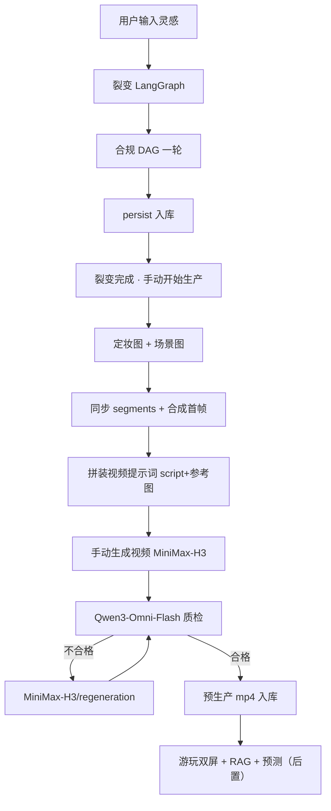

# AI 互动故事业务流程

> 产品主路径以 [流程.md](./流程.md) 为准；模型路由以 [模型调用.md](./模型调用.md) 为准。  
> **MVP 目标**：本地跑通「裂变 → 手动生产（定妆/场景/首帧/视频）」；游玩、RAG、预测补片为后置能力。

## 1. 阶段总览

| 阶段 | 做什么 | 产出 | 实现状态 |
| --- | --- | --- | --- |
| A. 裂变 | LangGraph：collect → bible → plot_tree → script → consistency → compliance → persist | 有限故事图 + 每节点 `script` + `blueprint` 骨架 | **已实现** |
| B. 视频素材生产 | 手动「开始生产」→ 定妆/场景 → 首帧 → 拼装提示词 →（手动）视频 → 质检 | 人物/场景图、首帧、shot prompt、预生产 mp4 | **已实现**（游玩未接） |
| C. 剧情预测 | 预判将走路径，提前约 7–8 段补片 | 补片 JOB | **未实现** |
| D. 游玩 | 左引擎播片+选项；右画布；RAG + 预测 | 可互动体验 | **未实现** |

与旧版差异：裂变结束后**不自动出图**；视频提示词由剧本**确定性拼装**，而非 LLM 重写；最少剧情线路径数默认 **`min_paths=8`**（环境变量 `MIN_STORY_LINES` 可覆盖，旧文档「30 线」为产品上限参考，非当前硬编码）。

---

## 2. 端到端流程（当前 + 目标）

---

## 3. 子流程

### 3.1 裂变

**编排**：`backend/app/graphs/fission_graph.py`（固定阶段图，非 ReAct 无限扩图 Agent）。

| 阶段 | 说明 |
| --- | --- |
| collect | 写入灵感、初始化 `fission_config` / `story_state` |
| bible | 故事圣经（世界观、角色、完成点） |
| plot_tree | 剧情树大纲；分叉用 **method / stance / info / risk** 填槽，避免机械 AUTO 岔路 |
| branch_script | 批量写节点 `script`（beats≥2、对白、`dramatic_state_*`、`visual_plan`） |
| consistency | 程序校验：路径数、环、parent/edges、剧本连贯等 |
| compliance | `apply_dag_compliance_once`（涉政/敏感，**默认改写不批量删线**）；全线标 pass，**不调** `review_plot_lines` |
| persist | 故事图 + `blueprint.json`、segments 计划骨架 |
| finish | `phase=done`；**不**自动进入生产 |

**节点剧本交付物**：`summary` 仅画布短摘要；可出片语义在 `script`（时码节拍 + 对白 + `visual_plan`）。选项 `label` 是玩家抉择（台词/动作/意图），不是结果摘要。

**规模约束**：`FissionConfig.min_paths`（默认 8）；单节点分叉深度 `branch_depth`（默认 3）；结局目标见 `ending_targets`。

### 3.2 视频素材生产（手动）

**触发**：Web 故事页「开始生产」→ `POST /produce`；视频阶段另点「生成视频」→ `POST /produce/videos`。

**静态阶段**（`produce_graph`：cast → scenes → segments → 标记进入首帧阶段）：

1. 人物定妆：`IMAGE_CHARACTER_MODEL`（默认 `gpt-image-2`）。
2. 场景图：`IMAGE_SCENE_MODEL`（默认 `nano-banana-2-lite`）。
3. 同步 segments：镜头承接标注、预生产 tier（`PREFETCH_SEGMENT_RATIO`）。

**首帧阶段**（`run_first_frames_phase`）：

4. 对 `first_frame_source=synthetic` 的段合成首帧（prompt 来自 `visual_plan.first_frame.depicts` + 场景/人物定妆描述）。
5. `continues_from_prev_shot` 的段在出片波次承接前驱尾帧，或首帧阶段跳过绑定。

**提示词拼装**（首帧就绪后，`assemble_shot_prompts_from_script`）：

6. `【参考图】`：首帧 `depicts`、定妆 **角色名**（来自 blueprint，非 `appearance_prompt`）。
7. 时码正文：各 beat 的 `shot` + `action` + 对白；承接镜头在首 beat 加注「承接上段末帧」。
8. **不调用 LLM 润色**；写入 `assets/prompts/{node_id}.json` 与 DB。

**出片与质检**：

9. MiniMax-H3（ephone）+ 首帧图；轮询完成后抽尾帧供链接。
10. Qwen3-Omni-Flash 审**单段 mp4 内部**；不合格 regeneration，有重试上限。
11. 状态 `awaiting_video` → `videos` → `qc` → `ready`。

**镜头承接**（与 `scene_id` 解耦）：`continues_from_prev_shot` 决定是否复用前驱尾帧；跨场景边强制不接尾帧。

**剧情连贯**（与尾帧不同）：父子 `dramatic_state_in/out` + 选项落地。

### 3.3 剧情预测（后置）

预测后续 7–8 段；缺片后台出片。接口与 Worker 图尚未落地。

### 3.4 互动游玩（后置）

目标：左引擎 + 选项 + RAG；右 ComfyUI/画布同步链路。

**当前 Web**：左侧裂变日志 / 素材图预览；右侧 **React Flow** 画布 + 节点剧本侧栏（`NodeScriptPanel`）。非完整游玩引擎。

---

## 4. 核心状态

### 4.1 裂变 `phase`

`idle` → `collect` → `bible` → `plot_tree` → `branch_script`（日志可能仍显示 script 阶段）→ `consistency` → `compliance` → `persist` → `done` | `failed`

### 4.2 生产 `produce_status`

`none` → `cast` → `scenes` → `prompts`（待首帧/待拼装）→ `frames` → `prompts`（拼装完成）→ `awaiting_video` → `videos` → `qc` → `ready`；另有 `paused` / `failed`

### 4.3 片段（segment）

`video_status` / `qc_status` / `first_frame_path` / `shot_prompt_status` 等见 `blueprint.segments`。

---

## 5. 与早期文档差异

| 早期表述 | 当前实现 |
| --- | --- |
| 单 FissionAgent ReAct 扩图 | 固定 LangGraph 阶段图 + 专用子图 |
| 裂变结束自动生产 | Web **手动**开始生产 |
| gpt-5.4-mini 写/润色视频提示词 | 首帧后 **script 确定性拼装** |
| 最少 30 条剧情线硬编码 | 默认 **min_paths=8**（可配置） |
| 合规逐条审剧情线 | DAG 一轮 + 全线 pass 标记 |
| 裂变完即可双屏游玩 | 生产可跑通；**游玩/RAG 未实现** |
