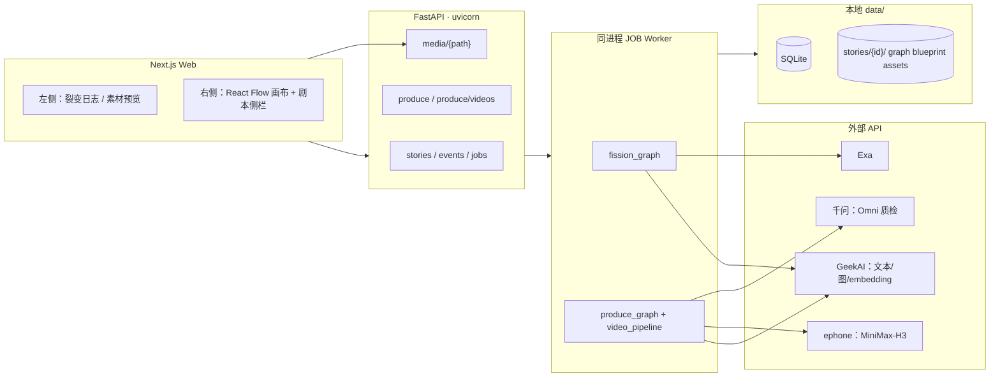
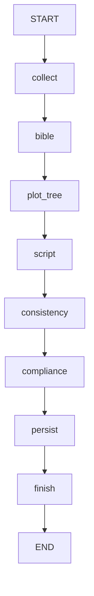

# AI 互动故事生产与游玩系统方案设计

> 依据 [需求文档.md](./需求文档.md)、[业务流程.md](./业务流程.md)、[流程.md](./流程.md)、[模型调用.md](./模型调用.md)。  
> **当前落地**：本地 FastAPI + Next.js；裂变 LangGraph + **手动生产**；游玩/RAG/预测为 P6+ 后置。

---

## 1. 实现状态（截至当前仓库）

| 能力 | 状态 | 说明 |
| --- | --- | --- |
| 裂变 LangGraph | ✅ | collect→bible→plot_tree→script→consistency→compliance→persist |
| Web 裂变进度 + 画布 | ✅ | 事件轮询、React Flow、`NodeScriptPanel` |
| 手动生产 | ✅ | 定妆→场景→segments→首帧→拼装提示词→视频→质检 |
| 媒体 API | ✅ | `GET /stories/{id}/media/assets/...` |
| 向量 / RAG / 游玩 | ⏳ | 无 `/play` 接口 |
| 剧情预测补片 | ⏳ | 未实现 |
| ComfyUI 嵌入双屏 | ⏳ | 画布为 React Flow；`comfy-workflow` 只读导出 |

---

## 2. 总体架构

### 2.1 业务链路

1. **裂变**：灵感 → 圣经 → 剧情树 → 节点剧本 → 一致性 → 合规 → 入库；
2. **生产**（手动）：定妆 → 场景 → segments → 首帧 → 拼装 shot prompt →（手动）MiniMax 出片 → Omni 质检 → regeneration；
3. **游玩**（后置）：引擎 + RAG + 预测补片；
4. **画布**：裂变/生产进度与故事图可视化。

### 2.2 架构图（当前）



### 2.3 设计原则

| 原则 | 说明 |
| --- | --- |
| 本地优先 | `DATA_DIR=./data`、SQLite、本地媒体 |
| 裂变与生产分离 | Web 裂变 `include_produce=False`；生产须手动 POST |
| 剧本驱动出片 | 可出片节点必有 `script`；提示词由 script 拼装 |
| 首帧先于最终提示词 | 首帧用 `visual_plan`；拼装时绑定真实 `first_frame_path` |
| 有限图 | `min_paths` 下限 + 剧情树校验；合规 DAG 一轮 |
| 禁止系统 Python | 仅仓库 `venv/bin` |
| 模型可配置 | `backend/.env` + [模型调用.md](./模型调用.md) |

### 2.4 技术栈

| 层级 | 技术 |
| --- | --- |
| 前端 | Next.js 15 + React 19 + TypeScript + Tailwind |
| 画布 | `@xyflow/react`（Comfy 风格节点卡片） |
| API | FastAPI + uvicorn |
| 编排 | LangGraph（`fission_graph`、`produce_graph`、子图） |
| 元数据 | SQLite + `data/stories/{id}/*.json` |
| 媒体 | `data/stories/{id}/assets/` |
| Python | `venv/` |

---

## 3. 仓库结构

```text
interactive_story/
├── venv/
├── docs/
├── frontend/                 # Next.js 故事列表 + 故事页
├── backend/
│   ├── app/
│   │   ├── api/v1/           # stories、produce、media
│   │   ├── graphs/           # fission_graph、produce_graph、子图
│   │   ├── agents/           # fission_tools、prompts
│   │   ├── services/         # asset_pipeline、video_pipeline、plot_tree_* …
│   │   ├── ai/               # geekai、ephone、dashscope
│   │   └── infrastructure/   # db、paths、orm
│   ├── scripts/              # run_fission_cli、run_pipeline_cli
│   └── tests/
├── data/                     # gitignore（故事与媒体）
├── Makefile
└── README.md
```

---

## 4. 裂变 LangGraph



- **compliance**：`apply_dag_compliance_once`；不批量 `review_plot_lines`。
- **finish** 后 Web 不自动 `produce`；CLI `run_pipeline_cli` 可 `include_produce=True` 串联生产。

---

## 5. 生产 LangGraph 与流水线

**静态子图**（`produce_graph`）：`cast` → `scenes` → `segments` → `ready_frames`（置 `produce_status=prompts`）。

**JOB 内顺序**（`produce_service.run_produce`）：

1. 跑静态子图（若尚未定妆/场景）；
2. `run_first_frames_phase`（合成 synthetic 首帧）；
3. `assemble_shot_prompts_from_script`（在首帧阶段末尾调用）；
4. `enter_awaiting_video`；
5. 用户触发 `POST /produce/videos` → `run_video_generation` → `run_qc_loop`。

**视频提示词拼装**（`video_prompt_assemble.py`）：

- `resolve_ref_bindings`：按 `visual_plan` 选首帧路径 + `character_refs` 定妆图；
- `assemble_prompt_from_script`：`【参考图】` + 时码 beats；
- 定妆行写 **角色名**；首帧行写 `first_frame.depicts`（裂变时 LLM 写入剧本）。

---

## 6. API（已实现）

| 方法 | 路径 | 说明 |
| --- | --- | --- |
| POST | `/api/v1/stories` | 创建故事 |
| POST | `/api/v1/stories/{id}/fission` | 触发裂变 JOB |
| GET | `/api/v1/stories/{id}` | meta + graph |
| GET | `/api/v1/stories/{id}/events` | 进度事件（`?since=`） |
| GET | `/api/v1/stories/{id}/production-blueprint` | blueprint.json |
| GET | `/api/v1/stories/{id}/media/{path}` | 媒体（须 `assets/...`） |
| POST | `/api/v1/stories/{id}/produce` | 开始/继续生产 |
| POST | `/api/v1/stories/{id}/produce/videos` | 开始视频出片 |
| POST | `/api/v1/stories/{id}/produce/resume` | 从 paused 恢复 |
| GET | `/api/v1/stories/{id}/produce` | 生产汇总 |
| GET | `/api/v1/jobs/{job_id}` | JOB 状态 |
| PATCH | `/api/v1/stories/{id}/nodes/{nid}/layout` | 画布坐标 |

**后置**：`/play/*`、RAG、predict。

---

## 7. 领域模型（摘要）

- **StoryNode**：`title`、`summary`、`script`（`NodeScript`）、`kind`、`scene_id`…
- **NodeScript**：`beats[]`、`dramatic_state_in/out`、`visual_plan`（`first_frame`、`character_refs`…）
- **blueprint**：`characters`、`scenes`、`nodes`、`segments`、`plot_lines`
- **segment**：`prompt_node_id`、`first_frame_source`、`continues_from_prev_shot`、`produce_tier`…
- **Job**：`fission` | `produce`；状态 pending/running/paused/succeeded/failed

---

## 8. AI 层

| 能力 | 模块 | 默认模型（.env） |
| --- | --- | --- |
| 裂变/合规文本 | `geekai_client` | `CHAT_MODEL` / `COMPLIANCE_MODEL` |
| 人物图 | `geekai_image` | `IMAGE_CHARACTER_MODEL` |
| 场景图 / 首帧 | `geekai_image` | `IMAGE_SCENE_MODEL` |
| 视频 | `ephone_video` | `VIDEO_MODEL` |
| 重生 | `ephone_video` | `VIDEO_REGEN_MODEL` |
| 质检 | `dashscope_omni` | `VIDEO_QC_MODEL` |
| 向量（占位） | `geekai_embedding` | `EMBEDDING_MODEL` |
| Exa | 子图/工具 | `EXA_API_KEY` |

视频提示词拼装：**无 LLM**（`assemble_shot_prompts_from_script`）。

---

## 9. 前端

### 9.1 故事页布局

- **左栏**：裂变日志 / 素材图（`ProduceAssetsPanel`）；生产按钮（开始生产 / 生成视频）。
- **右栏**：`StoryGraphCanvas` + 选中节点 `NodeScriptPanel`（时码剧本）。

### 9.2 素材图 URL

`storyAssetUrl(storyId, relPath)` → `{API_BASE}/api/v1/stories/{id}/media/{relPath}`。须同时运行 `make api`。

### 9.3 后置

双屏游玩引擎、ComfyUI 嵌入、RAG 选片 UI。

---

## 10. 环境变量

见 `backend/.env.example`。前端 `frontend/.env.local.example`：`NEXT_PUBLIC_API_BASE`。

---

## 11. 模块开发顺序（修订）

| 编号 | 模块 | 状态 |
| --- | --- | --- |
| P0 | 工程底座 | ✅ |
| P1 | 故事图 + script 模型 | ✅ |
| P2 | 裂变 LangGraph | ✅ |
| P3 | 定妆/场景/segments | ✅ |
| P4 | 首帧 + 拼装提示词 + MiniMax + QC | ✅ |
| P5 | 向量与 RAG | ⏳ |
| P6 | 游玩左屏 | ⏳ |
| P7 | 预测补片 | ⏳ |
| P8 | ComfyUI / 双屏打磨 | ⏳ |

---

## 12. 测试与验收（当前可验）

1. 本地 `make test`；
2. 灵感 → Web 裂变 → 画布增长 → `phase=done`；
3. 手动生产 → 素材图可见 → 首帧/提示词/视频进度在日志与 produce 汇总中推进；
4. `GET /media/assets/characters/*.png` 返回 200。

完整游玩验收见需求文档 §12（含未实现项）。

---

## 13. 风险与应对

| 风险 | 应对 |
| --- | --- |
| 剧情线数量极大 | 合规不逐条 LLM；路径计数用迭代算法 |
| 生产 API 配额 | `paused` + resume |
| 前端图 404 | 确认 `make api` 与 `NEXT_PUBLIC_API_BASE` |
| Next dev overlay `[object Event]` | 多为 15.1.0 误报或资源错误；查 Network 面板 |

---

## 14. 下一步

1. 向量入库 + RAG 硬过滤；
2. `/play/session` + 引擎播片；
3. 预测补片 JOB；
4. 可选：升级 Next.js ≥15.1.6 减少 dev overlay 误报。
